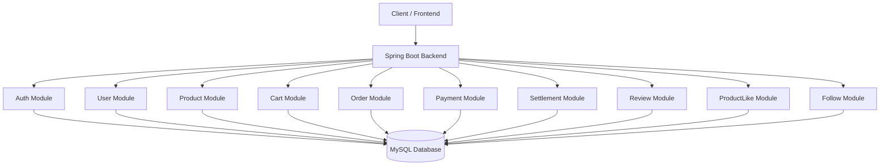
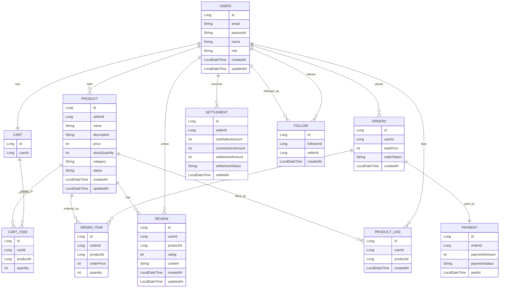

# Social Commerce Backend

## 프로젝트 소개

Social Commerce Backend는 사용자가 상품을 조회하고 구매할 수 있을 뿐만 아니라, 리뷰, 좋아요, 팔로우 같은 소셜 기능도 함께 사용할 수 있는 소셜 커머스 플랫폼 백엔드 프로젝트입니다.

이 프로젝트는 Java/Spring 기반 백엔드 개발 역량을 기르기 위해 회원, 인증, 상품, 장바구니, 주문, 결제, 정산, 리뷰, 좋아요, 팔로우 기능을 설계하고 구현하는 것을 목표로 합니다.

---

## 프로젝트 목표

* Java/Spring 기반 백엔드 프로젝트 설계 및 구현
* REST API 설계 연습
* 회원, 상품, 주문, 결제, 정산 도메인 이해
* 리뷰, 좋아요, 팔로우 등 소셜 기능 설계
* GitHub 커밋 기록을 통한 포트폴리오 관리
* README 기반 설계 문서 작성 경험 쌓기

---

## 사용자 역할

### Customer

일반 구매자입니다.

* 회원가입
* 로그인
* 상품 조회
* 장바구니 관리
* 주문 생성
* 결제
* 주문 내역 조회
* 리뷰 작성
* 상품 좋아요
* 판매자 팔로우

### Seller

상품을 판매하는 사용자입니다.

* 상품 등록
* 상품 수정
* 상품 삭제
* 주문 확인
* 배송 상태 변경
* 판매 내역 조회
* 정산 내역 조회

### Admin

서비스 관리자입니다.

* 회원 관리
* 상품 관리
* 주문 관리
* 신고 리뷰 관리
* 정산 관리

---

## MVP 개발 범위

초기 버전에서는 소셜 커머스 플랫폼의 모든 기능을 한 번에 구현하지 않고, 커머스 서비스의 핵심 흐름인 **회원 → 상품 조회 → 장바구니 → 주문 → 결제 → 재고 차감** 과정을 먼저 구현합니다.

### 1차 구현 범위

1차 구현에서는 사용자가 상품을 조회하고 주문을 완료하는 기본 커머스 흐름을 구현합니다.

* 회원가입
* 로그인
* 내 정보 조회
* 상품 등록
* 상품 목록 조회
* 상품 상세 조회
* 장바구니 상품 추가
* 장바구니 조회
* 장바구니 상품 수량 변경
* 장바구니 상품 삭제
* 주문 생성
* 주문 목록 조회
* 주문 상세 조회
* 가짜 결제 성공 처리
* 결제 성공 후 주문 상태 변경
* 결제 성공 후 상품 재고 차감

### 2차 구현 범위

2차 구현에서는 커머스 기능 위에 소셜 기능을 추가합니다.

* 상품 리뷰 작성
* 상품 리뷰 목록 조회
* 리뷰 수정
* 리뷰 삭제
* 상품 좋아요
* 상품 좋아요 취소
* 내가 좋아요한 상품 목록 조회
* 판매자 팔로우
* 판매자 팔로우 취소
* 내가 팔로우한 판매자 목록 조회

### 3차 구현 범위

3차 구현에서는 판매자와 관리자 기능을 확장합니다.

* 판매자 상품 관리
* 주문 배송 상태 변경
* 판매 내역 조회
* 판매자별 정산 금액 계산
* 정산 내역 조회
* 관리자 회원 관리
* 관리자 상품 관리
* 관리자 주문 관리
* 신고 리뷰 관리

---

## 주요 기능

### 1. 회원 기능

* 회원가입
* 로그인
* 로그아웃
* 내 정보 조회
* 회원 정보 수정
* 권한 관리

### 2. 인증/인가 기능

* 로그인 인증
* 사용자 권한별 API 접근 제어
* JWT 기반 인증 방식 적용 예정

### 3. 상품 기능

* 상품 등록
* 상품 목록 조회
* 상품 상세 조회
* 상품 수정
* 상품 삭제
* 상품 재고 관리
* 카테고리별 상품 조회

### 4. 장바구니 기능

* 장바구니 상품 추가
* 장바구니 조회
* 상품 수량 변경
* 장바구니 상품 삭제

### 5. 주문 기능

* 주문 생성
* 주문 목록 조회
* 주문 상세 조회
* 주문 취소
* 주문 상태 변경

주문 상태 예시:

```text
ORDER_CREATED
PAID
PREPARING
SHIPPED
DELIVERED
CANCELED
```

### 6. 결제 기능

초기 버전에서는 실제 결제 API 연동 대신 가짜 결제 흐름으로 구현합니다.

* 결제 요청
* 결제 성공 처리
* 결제 실패 처리
* 결제 취소

결제 상태 예시:

```text
READY
SUCCESS
FAILED
CANCELED
```

### 7. 정산 기능

판매자별 판매 금액을 기준으로 플랫폼 수수료를 제외한 정산 금액을 계산합니다.

* 판매자별 매출 집계
* 플랫폼 수수료 계산
* 정산 예정 금액 계산
* 정산 완료 처리
* 정산 내역 조회

정산 예시:

```text
상품 판매 금액: 100,000원
플랫폼 수수료: 5%
수수료 금액: 5,000원
판매자 정산 금액: 95,000원
```

### 8. 리뷰 기능

* 상품 리뷰 작성
* 상품 리뷰 목록 조회
* 리뷰 수정
* 리뷰 삭제
* 별점 등록

### 9. 좋아요 기능

* 상품 좋아요
* 상품 좋아요 취소
* 내가 좋아요한 상품 목록 조회

### 10. 팔로우 기능

* 판매자 팔로우
* 판매자 팔로우 취소
* 내가 팔로우한 판매자 목록 조회

---

## 핵심 주문 흐름

이 프로젝트의 핵심 흐름은 사용자가 상품을 장바구니에 담고, 주문을 생성한 뒤, 결제를 완료하면 재고가 차감되는 과정입니다.

1. 사용자가 회원가입 또는 로그인을 합니다.
2. 사용자가 상품 목록을 조회합니다.
3. 사용자가 상품 상세 정보를 확인합니다.
4. 사용자가 원하는 상품을 장바구니에 담습니다.
5. 사용자가 장바구니에서 상품 수량을 확인하거나 변경합니다.
6. 사용자가 장바구니 상품을 기반으로 주문을 생성합니다.
7. 주문 생성 시 주문 상품, 주문 수량, 주문 금액이 저장됩니다.
8. 사용자가 결제를 요청합니다.
9. 초기 버전에서는 실제 PG 결제 연동 없이 가짜 결제 성공 처리를 합니다.
10. 결제가 성공하면 주문 상태가 `PAID`로 변경됩니다.
11. 결제가 성공하면 주문한 상품의 재고가 차감됩니다.
12. 이후 주문 상태는 `PREPARING`, `SHIPPED`, `DELIVERED` 순서로 변경될 수 있습니다.

---

## 주문 상태 흐름

```text
ORDER_CREATED
     ↓
PAID
     ↓
PREPARING
     ↓
SHIPPED
     ↓
DELIVERED
```

주문 취소가 가능한 경우에는 주문 상태가 `CANCELED`로 변경됩니다.

```text
ORDER_CREATED → CANCELED
PAID          → CANCELED
```

---

## 결제 처리 방식

초기 버전에서는 실제 결제 API를 연동하지 않고, 결제 성공 또는 실패를 가정한 가짜 결제 흐름으로 구현합니다.

### 결제 성공 흐름

1. 사용자가 주문을 생성합니다.
2. 결제 요청을 보냅니다.
3. 서버는 결제 성공으로 처리합니다.
4. 결제 상태를 `SUCCESS`로 변경합니다.
5. 주문 상태를 `PAID`로 변경합니다.
6. 상품 재고를 차감합니다.

### 결제 실패 흐름

1. 사용자가 주문을 생성합니다.
2. 결제 요청을 보냅니다.
3. 서버는 결제 실패로 처리합니다.
4. 결제 상태를 `FAILED`로 변경합니다.
5. 주문 상태는 `ORDER_CREATED` 상태로 유지됩니다.
6. 상품 재고는 차감하지 않습니다.

---

## 재고 차감 정책

상품 재고는 주문 생성 시점이 아니라 **결제 성공 시점**에 차감합니다.

초기 버전에서는 단순하게 다음 규칙을 적용합니다.

* 결제 성공 시 상품 재고를 주문 수량만큼 차감합니다.
* 상품 재고가 주문 수량보다 적으면 주문을 생성할 수 없습니다.
* 주문 취소 시 차감된 재고를 다시 복구합니다.

예시:

```text
상품 재고: 10개
주문 수량: 2개
결제 성공 후 재고: 8개
```

---

## 정산 처리 방식

정산은 판매자별 판매 금액을 기준으로 플랫폼 수수료를 제외한 금액을 계산합니다.

초기 버전에서는 실제 은행 송금이나 외부 정산 시스템과 연동하지 않고, 서버 내부에서 정산 금액만 계산합니다.

### 정산 계산 예시

```text
상품 판매 금액: 100,000원
플랫폼 수수료율: 5%
플랫폼 수수료: 5,000원
판매자 정산 금액: 95,000원
```

### 정산 상태 예시

```text
READY
COMPLETED
CANCELED
```

---

## 주요 도메인

### User

회원 정보를 담당합니다.
`User`는 구매자, 판매자, 관리자를 모두 포함하는 회원 도메인입니다.
회원의 역할은 `role` 필드로 구분합니다.

역할 예시:

```text
CUSTOMER
SELLER
ADMIN
```

필드 예시:

* id
* email
* password
* name
* role
* createdAt
* updatedAt

### Product

상품 정보를 담당합니다.

* id
* sellerId
* name
* description
* price
* stockQuantity
* category
* status
* createdAt
* updatedAt

### Cart

사용자의 장바구니를 담당합니다.

* id
* userId

### CartItem

장바구니에 담긴 상품 정보를 담당합니다.

* id
* cartId
* productId
* quantity

### Order

주문 전체 정보를 담당합니다.
실제 테이블명은 SQL 예약어와의 충돌을 피하기 위해 `orders`를 사용할 예정입니다.

* id
* userId
* totalPrice
* orderStatus
* createdAt

### OrderItem

주문에 포함된 개별 상품 정보를 담당합니다.

* id
* orderId
* productId
* orderPrice
* quantity

### Payment

결제 정보를 담당합니다.

* id
* orderId
* paymentAmount
* paymentStatus
* paidAt

### Settlement

판매자 정산 정보를 담당합니다.
`Settlement`는 판매자 권한을 가진 `User`에게 지급될 정산 내역을 담당합니다.
판매자가 판매한 상품의 주문 금액을 기준으로 플랫폼 수수료를 제외한 정산 금액을 계산합니다.

* id
* sellerId
* totalSalesAmount
* commissionAmount
* settlementAmount
* settlementStatus
* settledAt

### Review

상품 리뷰 정보를 담당합니다.

* id
* userId
* productId
* rating
* content
* createdAt
* updatedAt

### ProductLike

상품 좋아요 정보를 담당합니다.
`Like`라는 이름은 SQL 문법이나 일반 단어와 혼동될 수 있으므로, 도메인과 테이블 이름은 `ProductLike` 또는 `product_like`를 사용할 예정입니다.

* id
* userId
* productId
* createdAt

### Follow

판매자 팔로우 정보를 담당합니다.

* id
* followerId
* sellerId
* createdAt

---

## 아키텍처 초안



### 계층별 역할

* Controller: 클라이언트의 HTTP 요청을 받고 응답을 반환합니다.
* Service: 비즈니스 로직을 처리합니다.
* Repository: 데이터베이스 접근을 담당합니다.
* Database: 회원, 상품, 주문, 결제, 정산 등의 데이터를 저장합니다.

---

## 모듈 구조 초안

```text
auth
user
product
cart
order
payment
settlement
review
productlike
follow
```

---

## API 설계 초안

### 인증 API

```text
POST   /api/auth/signup         회원가입
POST   /api/auth/login          로그인
POST   /api/auth/logout         로그아웃
```

### 회원 API

```text
GET    /api/users/me            내 정보 조회
PATCH  /api/users/me            내 정보 수정
```

### 상품 API

```text
POST    /api/products           상품 등록
GET     /api/products           상품 목록 조회
GET     /api/products/{id}      상품 상세 조회
PUT     /api/products/{id}      상품 수정
DELETE  /api/products/{id}      상품 삭제
```

### 장바구니 API

```text
POST    /api/cart/items         장바구니 상품 추가
GET     /api/cart               장바구니 조회
PATCH   /api/cart/items/{id}    장바구니 상품 수량 변경
DELETE  /api/cart/items/{id}    장바구니 상품 삭제
```

### 주문 API

```text
POST    /api/orders             주문 생성
GET     /api/orders             주문 목록 조회
GET     /api/orders/{id}        주문 상세 조회
PATCH   /api/orders/{id}/cancel 주문 취소
```

### 결제 API

```text
POST    /api/orders/{orderId}/payments          결제 요청
POST    /api/orders/{orderId}/payments/success  결제 성공 처리
POST    /api/orders/{orderId}/payments/fail     결제 실패 처리
POST    /api/orders/{orderId}/payments/cancel   결제 취소
```

### 정산 API

```text
GET     /api/settlements              정산 목록 조회
GET     /api/settlements/{id}         정산 상세 조회
POST    /api/settlements/calculate    정산 계산
```

### 리뷰 API

```text
POST    /api/products/{productId}/reviews       리뷰 작성
GET     /api/products/{productId}/reviews       리뷰 목록 조회
PATCH   /api/reviews/{reviewId}                 리뷰 수정
DELETE  /api/reviews/{reviewId}                 리뷰 삭제
```

### 좋아요 API

```text
POST    /api/products/{productId}/likes         상품 좋아요
DELETE  /api/products/{productId}/likes         상품 좋아요 취소
GET     /api/users/me/likes                     내가 좋아요한 상품 조회
```

### 팔로우 API

```text
POST    /api/sellers/{sellerId}/follow          판매자 팔로우
DELETE  /api/sellers/{sellerId}/follow          판매자 팔로우 취소
GET     /api/users/me/follows                   내가 팔로우한 판매자 조회
```

---

## ERD 초안



### 관계 설명

* 한 명의 판매자는 여러 상품을 등록할 수 있습니다.
* 한 명의 고객은 하나의 장바구니를 가집니다.
* 하나의 장바구니에는 여러 상품이 담길 수 있습니다.
* 한 명의 고객은 여러 주문을 할 수 있습니다.
* 하나의 주문에는 여러 주문 상품이 포함됩니다.
* 하나의 주문에는 하나의 결제 정보가 연결됩니다.
* 한 명의 판매자는 여러 정산 내역을 가질 수 있습니다.
* 한 명의 사용자는 여러 리뷰를 작성할 수 있습니다.
* 한 명의 사용자는 여러 상품에 좋아요를 누를 수 있습니다.
* 한 명의 사용자는 여러 판매자를 팔로우할 수 있습니다.

---

## 기술 스택 예정

* Language: Java
* Framework: Spring Boot
* Database: MySQL
* ORM: JPA
* Build Tool: Gradle
* Version Control: Git, GitHub
* API Test: Postman

---

## 개발 순서

### 1단계: 설계

* 프로젝트 주제 정리
* 요구사항 정리
* 주요 기능 목록 작성
* MVP 개발 범위 설정
* 핵심 주문 흐름 정리
* 도메인 설계
* API 설계
* ERD 초안 작성

### 2단계: 프로젝트 생성

* Spring Boot 프로젝트 생성
* GitHub 저장소 연동
* 기본 패키지 구조 생성
* README 정리

### 3단계: 핵심 기능 구현

* 회원가입 기능
* 로그인 기능
* 상품 기능
* 장바구니 기능
* 주문 기능
* 가짜 결제 성공 처리
* 재고 차감 처리

### 4단계: 확장 기능 구현

* 정산 기능
* 리뷰 기능
* 좋아요 기능
* 팔로우 기능
* 관리자 기능

### 5단계: 포트폴리오 정리

* API 문서 정리
* ERD 이미지 추가
* 아키텍처 그림 추가
* 실행 방법 작성
* 트러블슈팅 정리

---

## 1차 구현 목표

현재 프로젝트의 1차 목표는 전체 기능을 모두 완성하는 것이 아니라, 백엔드 개발의 핵심 흐름을 경험하는 것입니다.

1차 구현에서 집중할 내용은 다음과 같습니다.

* REST API 설계
* 회원가입과 로그인 흐름 이해
* 상품 도메인 설계
* 장바구니 도메인 설계
* 주문 도메인 설계
* 결제 성공 처리 흐름 이해
* 주문 상태 변경
* 상품 재고 차감
* MySQL 기반 데이터 저장
* JPA를 활용한 도메인 매핑

---

## 1차 구현 제외 범위

다음 기능들은 초기 버전에서는 구현하지 않고, 추후 확장 기능으로 분리합니다.

* 실제 PG 결제 연동
* 실제 배송사 API 연동
* 쿠폰 기능
* 포인트 기능
* 환불 기능
* 교환 기능
* 실시간 알림 기능
* 추천 시스템
* 관리자 대시보드
* 대규모 트래픽 처리
* 동시성 재고 제어 고도화

---

## 향후 추가할 내용

* ERD 이미지
* 아키텍처 다이어그램
* API 명세서
* 예외 처리 전략
* 인증/인가 방식
* 테스트 코드
* 배포 방법
* 트러블슈팅 기록
